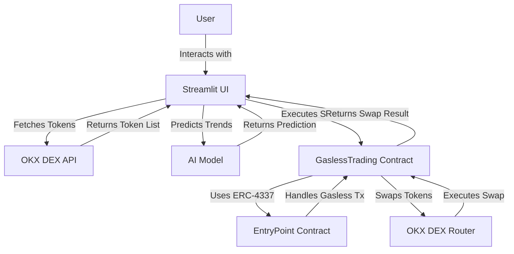

# AI-Powered Gasless DeFi Trading Assistant
## Overview
The AI-Powered Gasless DeFi Trading Assistant is a decentralized finance (DeFi) application that enables users to perform gasless token swaps on the OKX DEX using ERC-4337 (Account Abstraction) for gasless transactions. The project integrates a smart contract (GaslessTrading.sol) with a Streamlit-based frontend (app.py) and leverages AI for market trend predictions. The application supports multiple blockchains (Ethereum, BNB Chain, Polygon) and provides a user-friendly interface for trading with minimal gas costs.

## Features

1. **Gasless Transactions:** Uses ERC-4337 to enable gasless token swaps via the GaslessTrading smart contract.
2. **AI Market Analysis:** Predicts market trends using a mock AI model (replaceable with real market data).
3. **OKX DEX Integration:** Fetches tokens and executes swaps using the OKX DEX API.
4. **Multi-Chain Support:** Supports Ethereum, BNB Chain, and Polygon.
5. **User-Friendly UI:** Built with Streamlit for an interactive frontend.

## Project Structure

1. **contracts/:** Contains the Solidity smart contract (GaslessTrading.sol).
2. **scripts/:** Hardhat deployment script (deploy.js).
3. **defigrok/:** Streamlit app directory containing app.py and .env for API credentials.
4. **hardhat.config.js:** Hardhat configuration for compiling and deploying the contract.
5. **package.json:** Node.js dependencies for the Hardhat project.

## Prerequisites

1. Node.js and npm: For Hardhat and contract deployment.
2. Python 3.8+: For the Streamlit app.
3. OKX API Key: Required for OKX DEX API access (apply via OKX Developer Portal).
4. Wallet: A wallet with testnet funds (e.g., OKT Chain testnet or Sepolia).

## Setup Instructions
1. Clone the Repository
```bash
git clone <repository-url>
cd Trading_Assistant
```

2. Set Up the Hardhat Project

Navigate to the project root:cd contracts

```bash
Install dependencies:npm install
npm install --save-dev @nomicfoundation/hardhat-toolbox
npm install @openzeppelin/contracts@4.9.3
```

Update .env with your wallet private key:PRIVATE_KEY=your_wallet_private_key


Update hardhat.config.js with the correct OKT Chain testnet RPC URL (find the latest URL via chainlist.org or OKX documentation):require("@nomicfoundation/hardhat-toolbox");
```bash
require("dotenv").config();

module.exports = {
  solidity: "0.8.20",
  networks: {
    okt: {
      url: "https://oktc-testnet-rpc.okx.com", // Replace with the correct URL
      accounts: [process.env.PRIVATE_KEY],
    },
    sepolia: {
      url: "https://rpc.sepolia.org",
      accounts: [process.env.PRIVATE_KEY],
    },
  },
};
```

3. Compile and Deploy the Smart Contract

Compile the GaslessTrading.sol contract:npx hardhat compile


Update scripts/deploy.js with the correct entryPoint and okxDexRouter addresses for your target network:const hre = require("hardhat");

```bash
async function main() {
  const [deployer] = await hre.ethers.getSigners();
  console.log("Deploying contracts with:", deployer.address);

  const GaslessTrading = await hre.ethers.getContractFactory("GaslessTrading");
  const entryPoint = "0x5FF137D4b0FDCD49DcA30c7CF57E578a026d2789"; // ERC-4337 EntryPoint (Sepolia)
  const okxDexRouter = "0x<OKX-DEX-Router-Address>"; // Replace with OKX DEX Router address
  const initialOwner = deployer.address;
  const gaslessTrading = await GaslessTrading.deploy(entryPoint, okxDexRouter, initialOwner);

  await gaslessTrading.deployed();
  console.log("GaslessTrading deployed to:", gaslessTrading.address);
}

main().catch((error) => {
  console.error(error);
  process.exitCode = 1;
});
```

Deploy to OKT Chain testnet (or Sepolia for testing):npx hardhat run scripts/deploy.js --network okt

Note the deployed contract address for use in the Streamlit app.

4. Set Up the Streamlit App

Navigate to the Streamlit directory:cd Trading_Assistant

run:
```bash
uv pip install -r pyproject.toml
```

Update .env with your OKX API credentials (apply for a V5 API key via the OKX Developer Portal):
```bash
OKX_API_KEY=your_api_key
OKX_SECRET_KEY=your_secret_key
OKX_API_PASSPHRASE=your_chosen_passphrase
OKX_PROJECT_ID=your_project_id
```

Update app.py with the correct OKX DEX API base URL (find the new domain via OKX documentation or resolve https://t.co/JeqoL6cl6K from @OKXHelpDesk’s X post on May 16, 2025):BASE_URL = "https://dex-api.okx.com"  # Replace with the actual domain


5. Run the Application

Start the Streamlit app:streamlit run app.py


Open http://localhost:8501 in your browser to interact with the app.

## Usage

1. Select Blockchain: Choose a blockchain (Ethereum, BNB Chain, Polygon) from the sidebar.
2. Configure Trade Settings: Enter your wallet address, token addresses, and amount to trade.
3. Analyze Market: Click “Analyze Market” to get a mock AI prediction (replace with real market data in production).
4. Execute Trade: Click “Execute Trade” to perform a gasless swap via the GaslessTrading contract and OKX DEX API.
5. View Portfolio: See a mock portfolio chart (replace with real data in production).

## Project Architecture
The following Mermaid diagram illustrates the architecture of the AI-Powered Gasless DeFi Trading Assistant:


## Components

1. Streamlit UI (app.py): The frontend interface for user interaction.
2. OKX DEX API: Fetches token data and executes swaps.
3. GaslessTrading Contract: Solidity contract for gasless swaps using ERC-4337.
4. EntryPoint Contract: Handles gasless transactions via ERC-4337.
5. OKX DEX Router: Executes token swaps on the OKX DEX.

## Troubleshooting

### Hardhat Compilation Fails:
Ensure the project structure is correct: contracts/GaslessTrading.sol should be in the contracts/ folder, and hardhat.config.js should be in the root.
Run npx hardhat clean and then npx hardhat compile.


### Deployment Fails:
Verify testnet funds in your wallet.
Ensure the entryPoint and okxDexRouter addresses in deploy.js are correct for your network.


### OKX DEX API Errors:
1. 401 Unauthorized: Recreate your API key via the OKX Developer Portal and update .env.
2. 404 Not Found: Verify the /all-tokens endpoint in OKX documentation; it may have been renamed.
3. DNS Resolution Error: Update BASE_URL to the new domain (resolve https://t.co/JeqoL6cl6K).


## License
This project is licensed under the Apache License.
